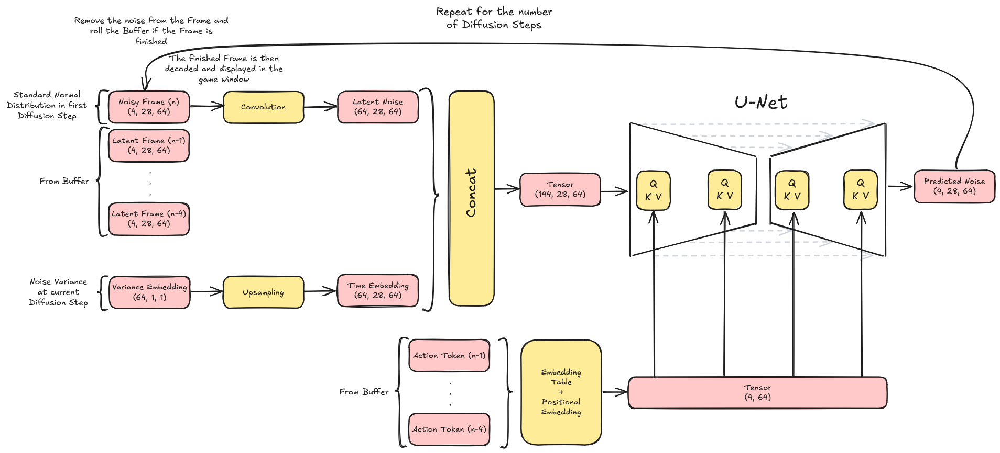

# Dream Mario Kart

This project uses diffusion models to generate the next frame in real-time. The Model is trained on the video game Super
Mario Kart. It takes in the last four frames and actions as input and generates the next frame. The training data was
collected by an AI agent learning to play the game.

## Results

The following video shows the results of the model in real-time.


## Explanation

This project is based on the paper [DIFFUSION MODELS ARE REAL-TIME GAME ENGINES](https://arxiv.org/pdf/2408.14837). The
implementation was made entirely from scratch except for the gym-retro integration.

The following steps were taken to create the model:

1. **Data Collection**: The data was collected using a PPO agent that learned to play the game. The agent was trained
   for 100 Epochs in 16 parallel environments. The data was collected in the form of frames and corresponding actions.
2. **Training the autoencoder**: To have better performance, an autoencoder was trained on the frames to reduce the
   dimensionality of the data.
3. **Training the diffusion model**: The diffusion model was trained on the data collected by the PPO agent. First the
   autoencoder brings the frames to a latent space, then the diffusion model is trained on the latent space. The model
   takes in the last four frames and actions as input and generates the next frame.
4. **Inference**: The model is used to generate the next frame in real-time in an interactive game window. The model
   takes in the last four frames and actions as input and generates the next frame. The generated frame is then decoded
   using the autoencoder and displayed in the game window. The following figure shows the exact process including the
   shapes of the tensors during inference.



## Installation for inference

If you want to try out the pretrained model, follow these steps:

1. **Clone the repository**: Clone the repository to your local machine. You may need to set up git-lfs to download the
   pretrained model.
    ```bash
    git clone https://github.com/ProfessorNova/Dream-Mario-Kart.git
    cd Dream-Mario-Kart
    ```

2. **Set Up Python Environment**: Make sure you have Python installed (tested with Python 3.10.11). Optionally, you can
   create a virtual environment.
    ```bash
    # On Windows
    python -m venv venv
    .\venv\Scripts\activate
   
    # On Linux
    python -m venv venv
    Source venv/bin/activate
    ```

3. **Install Dependencies**: Install the required dependencies using pip.
    ```bash
    pip install -r req.txt
    ```
   For proper PyTorch installation, check the official [PyTorch website](https://pytorch.org/get-started/locally/) and
   follow the instructions based on your system configuration.

4. **Start Inference**: Go into the `sd` folder and run the `play_sd.py` script. This will automatically use the
   pretrained model for inference.
    ```bash
    cd sd
    python play_sd.py
    ```

## Installation for training

If you want to train the model yourself we will need to set up the OpenAI Retro Integration.
I got the environment from the
repository [esteveste/gym-SuperMarioKart-Snes](https://github.com/esteveste/gym-SuperMarioKart-Snes)

This is a bit tricky to set up, since the repository will only work with some older versions of python and gym.
The most easy way to set it up is to use miniconda to create a new environment with the right versions of python and
gym.

1. Install [Miniconda](https://docs.conda.io/en/latest/miniconda.html) if you don't have it already.
2. Create a new conda environment with the right version of python.
    ```bash
    conda create -n retro python=3.8
    conda activate retro
    ```
3. Install `gym` and `gym-retro` with the correct versions.
    ```bash
    pip install gym==0.17.2
    pip install gym-retro
    ```
4. Copy the folder `SuperMarioKart-Snes` from
   the [esteveste/gym-SuperMarioKart-Snes](https://github.com/esteveste/gym-SuperMarioKart-Snes) repository into a path
   like `site-packages/retro/data/stable/SuperMarioKart-Snes` inside the conda environment. Going from the miniconda
   installation directory it should be
   `miniconda3/envs/retro/Lib/site-packages/retro/data/stable/SuperMarioKart-Snes`.

5. Install the rest of the requirements.
    ```bash
    pip install torch torchvision tensorboardX tqdm opencv-python pygame
    ```
   For proper PyTorch installation, check the official [PyTorch website](https://pytorch.org/get-started/locally/) and
   follow the instructions based on your system configuration.

6. You can test if the installation was successful by running the following script.
    ```bash
    cd ppo
    python view_mario_kart_env.py
    ```
   This should open a window with the game running. You can close it with `q`.

## Training

It is recommended to use a GPU for training.
You will need to execute three training scripts in total.

1. **Train the PPO agent**: This will collect the data for training the diffusion model. The data will be saved in the
   `ppo/checkpoints/<run_name>/trajectories.npz` folder after the 100 epochs are finished.
    ```bash
    cd ppo
    python train_ppo.py
    ```

2. **Train the autoencoder**: First copy the `trajectories.npz` file from the PPO training into the `sd/data` folder.
   Then run the autoencoder training script. This will create a folder called `output_autoencoder` in the `sd` folder
   with the trained model.
    ```bash
    cd sd
    python train_autoencoder.py
    ```

3. **Train the diffusion model**: This will train the diffusion model on the data collected by the PPO agent. The
   trained model will be saved in the automatic created `output_sd` folder in the `sd` folder.
    ```bash
    python train_sd.py
    ```

4. **Inference**: After training, you can run the inference script to test your trained model. Call the `play_sd.py`
   with the correct paths to the trained models and initial_sequence.
    ```bash
    python play_sd.py --decoder-path output_autoencoder/decoder.pt --model-path output_sd/best.pt --trajectory-path output_sd/initial_sequence.npz
    ```

5. **Try out other tracks or even games**: I welcome you to try out other tracks to train a diffusion model on. You can
   simply modify the `ppo/lib/utils.py` file to change the track. You can find a commented example line for Rainbow
   Road. If you want to try out other games you might need to modify the PPO agent a bit. But as soon as you have the
   trajectories file the rest of the training should work without any problems.

## Acknowledgements

This project is based on the paper [DIFFUSION MODELS ARE REAL-TIME GAME ENGINES](https://arxiv.org/pdf/2408.14837) by
Dani Valevski, Yaniv Leviathan, Moab Arar and Shlomi Fruchter.

Thanks to the [esteveste/gym-SuperMarioKart-Snes](https://github.com/esteveste/gym-SuperMarioKart-Snes) repository for
an easy integration of Super Mario Kart into gym-retro.
